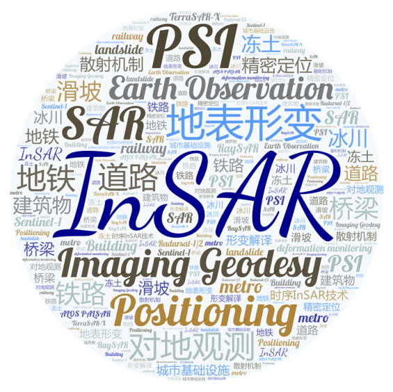

# 课题组研究方向： #
## 雷达遥感数据智能处理和地学应用，包括： ##
(1)  雷达遥感数据处理； SAR/InSAR/极化SAR数据处理方法；时序InSAR分析方法；  
(2)  深度学习及机器学习算法在雷达遥感数据中的应用研究；  
(3)  雷达遥感城市基础设施健康诊断，包括铁路、建筑物、机场、地铁、水电站等；  
(4)  雷达遥感地质灾害监测应用，包括地面沉降、滑坡、地裂缝等；

