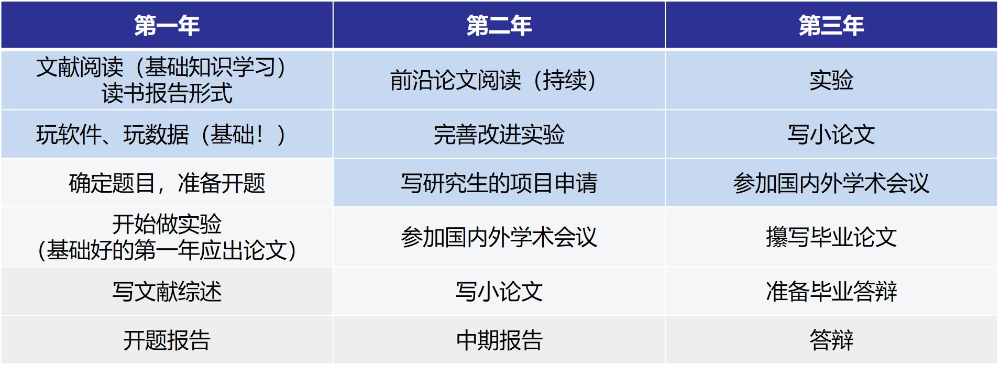
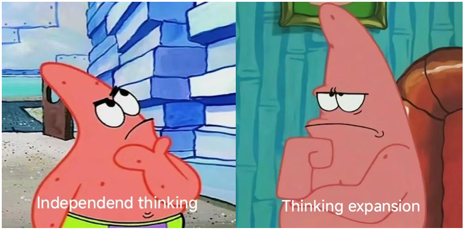

# Research interests： #
## 雷达遥感数据智能处理和地学应用，包括： ##
(1)  雷达遥感数据处理； SAR/InSAR/极化SAR数据处理方法；时序InSAR分析方法；

(2)  深度学习及机器学习算法在雷达遥感数据中的应用研究；

(3)  雷达遥感城市基础设施健康诊断，包括铁路、建筑物、机场、地铁、水电站等；

(4)  雷达遥感地质灾害监测应用，包括地面沉降、滑坡、地裂缝等；
   
# Admission Information： #
## 研究生招生  ##

### 课题组每年招收2-3名硕士生 ###
 招生专业一：地图学与地理信息系统  学术型硕士（专业代码07+）
 
招生专业二：资源与环境工程  专业型硕士（专业代码08+）
欢迎具有地理信息科学、测绘科学、遥感科学、空间信息技术、信息与信号处理、电子信息、计算机技术、软件工程、人工智能、大数据、模式识别与智能系统、地球物理等专业背景同学报考！
   

# We are always looking for highly motivated students to join our lab. #

# 研究生培养计划 #

  
## 我对你们研究生生涯/毕业论文的期待 ##

### 做一篇10年后再看都不会觉着丢脸的硕士论文  ###
   
## 课题组能为你们提供什么？ ##

   
# 课题组学习建议 #
 **每周工作42-60小时，每天7-10小时（6天）[学习借鉴了下fudan unvi.]**
  
举例：早上9点到11点走（2个小时），下午2点到5点（3个小时），晚上7点到9点（2个小时）
  
**保证每个月至少读4篇论文，一周一篇，**
   
建议：research gate关注学者，像刷微博一样每天刷research gate。
  
**固定每周至少来和老师聊一下，任何事情都可以，保持见面**

开题报告、研究生项目、中期报告等材料提前给，注意deadline前3天给的，默认不需要意见  

**掌握一个软件能力：** MATLAB/python/ArcGIS/GMT/GEE/origin/GAMMA等
  

### 梦导要求：游戏打得好，代码扣的6~  ###

 

### 组内娱乐生活多样，高手云集~  ### 

 

### 欢迎进组共同进步~~~ ###

