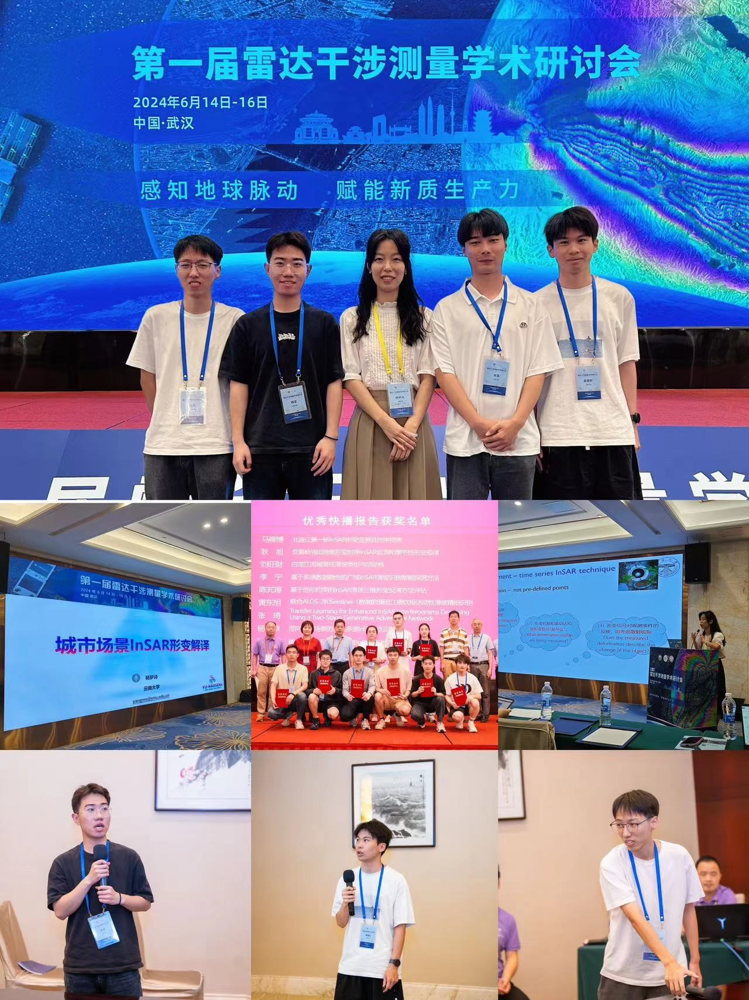
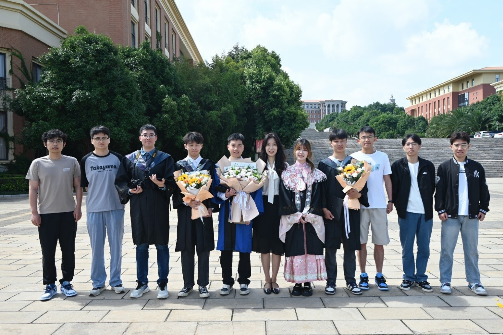
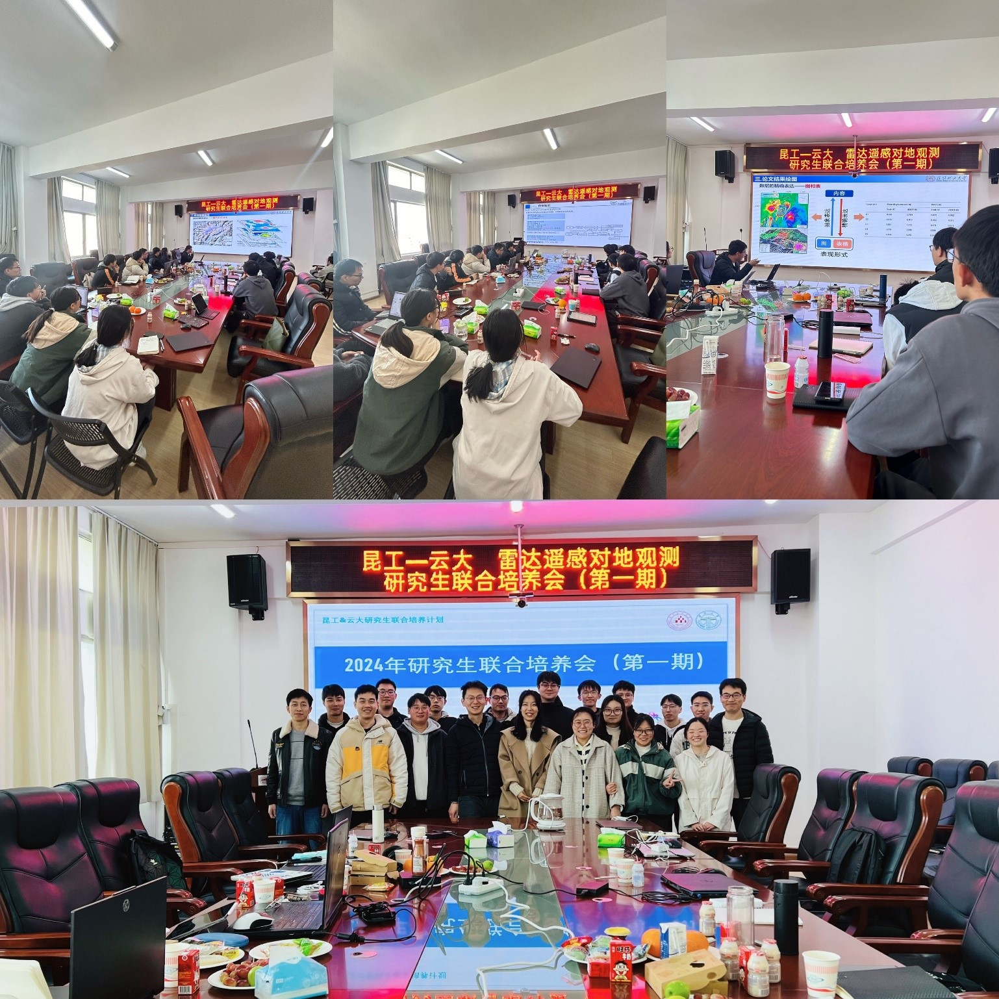

#  2024年6月课题组参加第一届雷达干涉测量学术研讨会   #
## (杨梦诗，杨卓，喻航，黄委彬，吴昊，武汉） ##
### 祝贺研究生杨卓获优秀快播报告奖！ ### 

   
# 2024年6月毕业季课题组合影 #
## (毕业生：研究生温明淳，本科生黄委彬、吴昊、欧钧杰、宋雨乔) ##
### 祝贺： ###
### 研究生温明淳升学中山大学攻读博士，毕业论文答辩优秀 ###
### 本科生黄委彬、吴昊升学云南大学，黄委彬、欧钧杰获云南大学优秀毕业论文 ###
### 本科生宋雨乔升学香港大学，欧钧杰升学新南威尔士大学 ###

	
   
# 2024年1月课题组与昆工雷达遥感课题组联合培训会（第一期） #

   
# 2023年12月课题组在IET-IRC国际雷达大会 #
## (Ramon Hanssen , 杨梦诗，温明淳，李赛伟，重庆) ##
