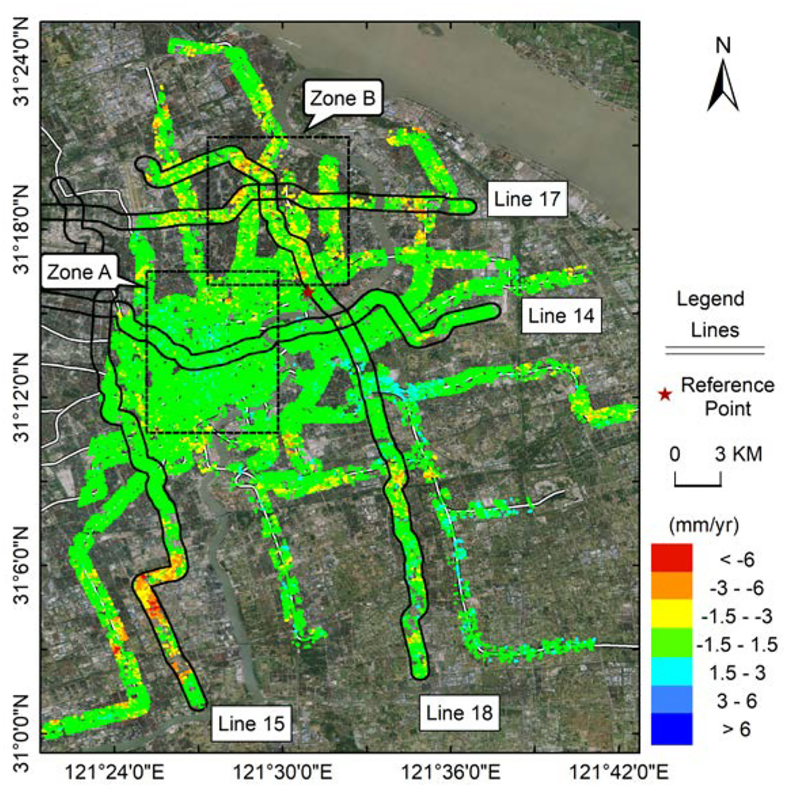
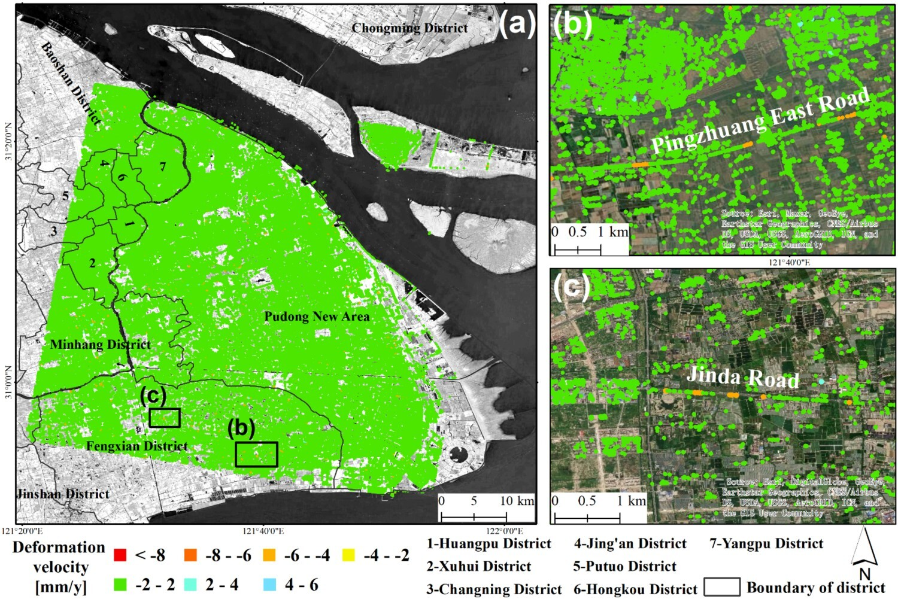

# Newly published #
## A PSI targets characterization approach to interpreting surface displacement signals: A case study of the Shanghai metro tunnels ##
### Abstract ###

Persistent Scatterer Interferometry (PSI) is a multi-epoch InSAR method for measuring displacements of Earth's surface over time by exploring the interferometric phase of constantly coherent points, named Persistent Scatterer (PS). PSI has shown its superior capability to monitor linear features with long-distance and large-span characteristics. Nevertheless, the interpretation of estimated displacements over PS is a challenge to overcome. Here, we propose a target characterization approach for multi-epoch InSAR post-processing to efficiently correlate the target's possible deformation types and corresponding deformation characteristics. The PS targets were categorized into elevated (ELV) and ground (GRD) groups. The deformation signals are assigned into four types: Defo-Type I stable, Defo-Type II shallow, Defo-Type III structural, and Defo-Type IV mixed deformation based on the ELV versus GRD differential motion estimation. Our approach is demonstrated over the metro network of Shanghai city, China using High-resolution TerraSAR-X data. The seven-year displacements map along Shanghai metro lines estimated by PSI shows that 85% of the points are relatively stable, while only 0.07% exhibits a significant deformation trend. We performed the stability evaluation along the subway by incorporating velocity, cumulative and relative deformation. It was found that the lines that have been operated for a long time are relatively stable, and obvious deformations were observed on the newly built lines and the extension sections of existing lines. By interpreting deformation types, We inferred that the displacements along metro lines mainly corresponded to Defo-Type II, and the areas with obvious deformation involve the superposition of multiple deformation types.

 

## Investigating deformation along metro lines in coastal cities considering different structures with InSAR and SBM analyses ##
### Abstract ###
The metro system solves traffic congestion in urban transportation while bringing potential deformation risks, especially in tunnels built in typical soft deposits in coastal cities. Time-series Synthetic Aperture Radar Interferometry (TS-InSAR) is an effective tool for monitoring land subsidence in urban areas. However, the different structures of metro lines, such as elevated tracks, ground lines, and tunnels, were often neglected in previous studies. Here, we introduced a Station Based Monitoring (SBM) method combined with InSAR analyses for metro safety monitoring. TS-InSAR provided the measurements along the elevated rails and ground lines. For tunnels, the TS-InSAR and SBM were jointly performed to deduct partial deformation under tunnels caused by land subsidence. The proposed metro system monitoring strategy was demonstrated and validated over the Shanghai Metro and Tianjin Rail Transit in the coastal cities of China. The results show that most deformed sections are located on the metro network's periphery, with velocities around −5 mm/year in Shanghai and −25 mm/year in Tianjin. The spatial distribution and temporal evolution of deformation characteristics along the two cases were then explored and compared. The proposed hazard matrix combining geological conditions and passenger density provided a more comprehensive assessment of potential hazards. The study highlights that InSAR and SBM analyses could be potentially applied to monitoring metro systems considering different structures.

 

## Decomposing and mapping different scales of land subsidence over Shanghai with X- and C-Band SAR data stacks ##

### Abstract ###
Land subsidence can be observed with time-series of Interferometric Synthetic Aperture Radar (InSAR) data. However, existing approaches only reveal subsidence signals that are multi-scale mixed, which is not conducive to the systematic analysis of subsidence of different mechanisms. A deformation signal decomposition (DSD) method based on spectral analysis is used to decompose the deformation extracted by time-series InSAR into three classes of deformation signals. They refer to large-scale deformation related to geological settings, medium-scale deformation caused more by group excavation, and small-scale deformation along linear infrastructures. TerraSAR-X datasets for Shanghai spanning April 2013 to September 2020, and Sentinel-1A datasets spanning January 2016 to September 2020 are used in this study. The results were cross-verified between the TerraSAR-X and Sentinel-1A datasets, and validated against levelling measurements. Subsidence signals caused by different mechanisms were automatically decomposed, which facilitates a systematic analysis for targeted diagnosis of land subsidence signals. A detailed analysis was conducted jointly at three scales of surface displacement, geological conditions, major construction activities, and subsidence mechanisms. It indicated that construction activities were the leading cause of land subsidence, and suggests that local authorities that wish to mitigate surface subsidence may benefit from primarily considering this process.

 
  